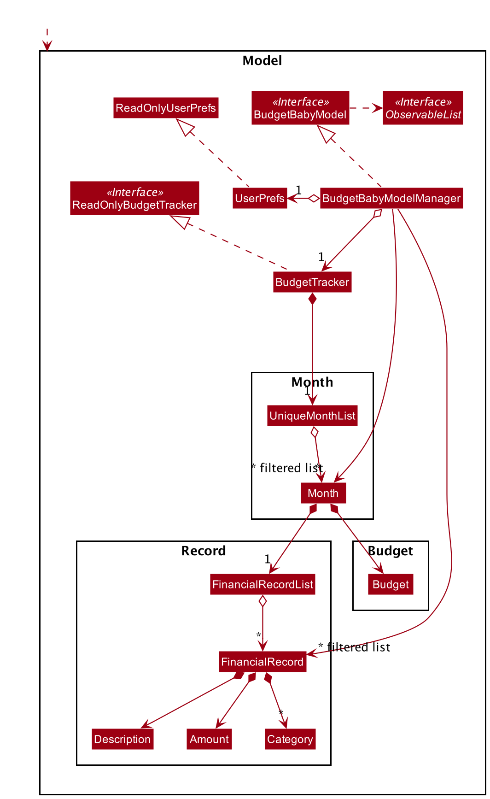
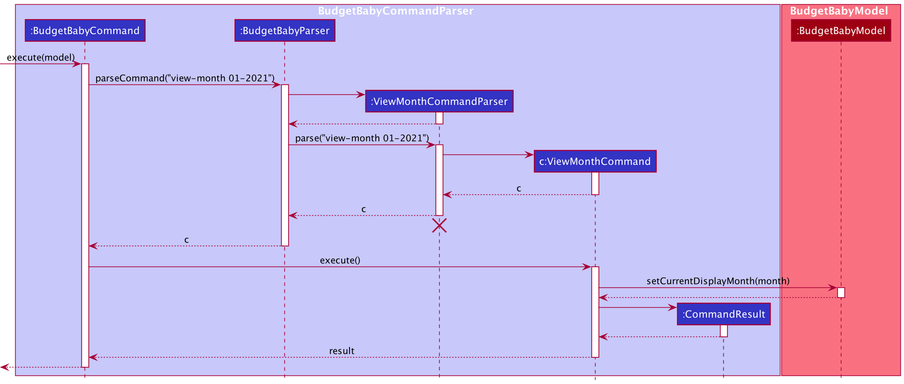
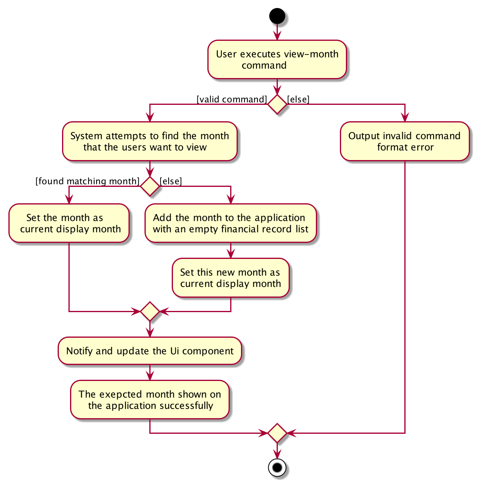
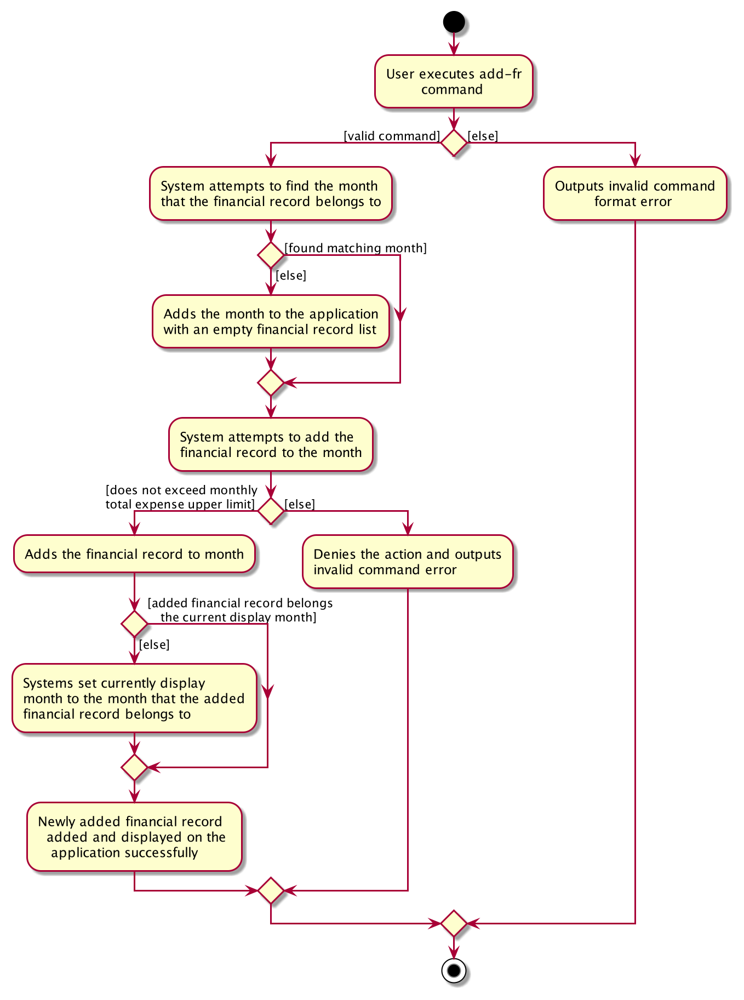
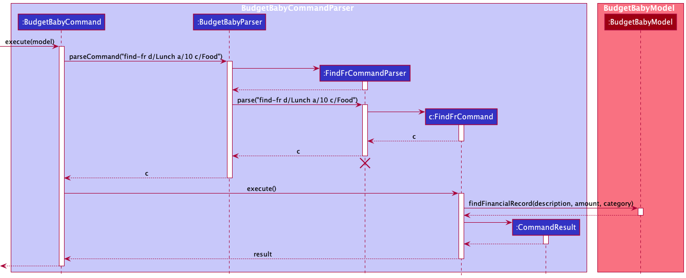
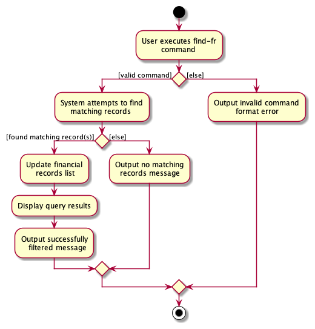
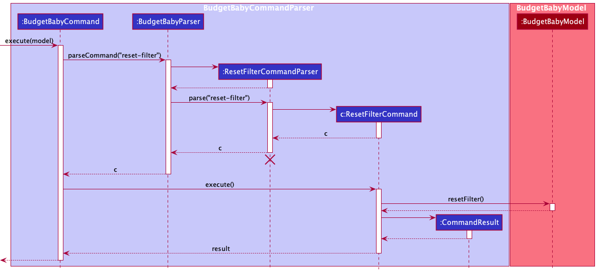
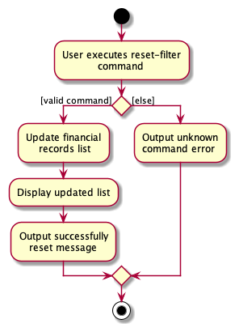
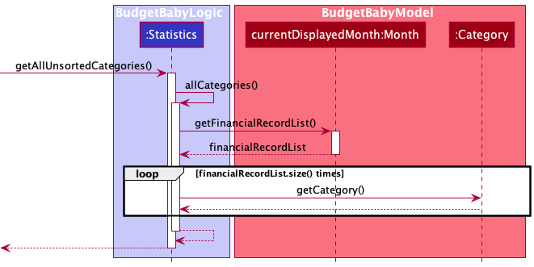
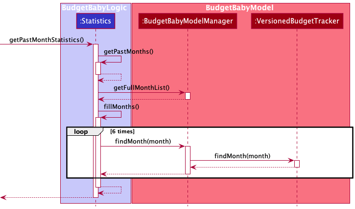

  
  <h1 align="center" style="margin-top:15px;">BudgetBaby :baby: :money_with_wings: Developer Guide</h1>

 

**BudgetBaby** is a **budget and expenses tracking desktop app for University students and/or those who are looking to
better manage their finances**. It is **optimized for use via a Command Line Interface** (CLI) so that entering and
editing financial records and budgets can be done faster by typing in commands while still having the benefits of a
Graphical User Interface (GUI).

This document aims to guide developers ...

## Table of Content

- [Setting up, getting started](#setting-up-getting-started)

## **Setting up, getting started**

Refer to the guide [_Setting up and getting started_](SettingUp.md).

## **Design**

### Architecture

The **_Architecture Diagram_** given above explains the high-level design of the App. Given below is a quick overview of each component.

:bulb: **Tip:** The `.puml` files used to create diagrams in this document can be found in the [diagrams](https://github.com/AY2021S2-CS2103T-W14-2/tp/tree/master/docs/diagrams) folder. Refer to the [_PlantUML Tutorial_ at se-edu/guides](https://se-education.org/guides/tutorials/plantUml.html) to learn how to create and edit diagrams.

**`Main`** has two classes called [`Main`](https://github.com/AY2021S2-CS2103T-W14-2/tp/blob/master/src/main/java/seedu/budgetbaby/Main.java) and [`MainApp`](https://github.com/AY2021S2-CS2103T-W14-2/tp/blob/master/src/main/java/seedu/budgetbaby/MainApp.java). It is responsible for,

- At app launch: Initializes the components in the correct sequence, and connects them up with each other.
- At shut down: Shuts down the components and invokes cleanup methods where necessary.

[**`Commons`**](#common-classes) represents a collection of classes used by multiple other components.

The rest of the App consists of four components.

- [**`UI`**](#ui-component): The UI of the App.
- [**`BudgetBabyLogic`**](#logic-component): The command executor.
- [**`BudgetBabyModel`**](#model-component): Holds the data of the App in memory.
- [**`BudgetBabyStorage`**](#storage-component): Reads data from, and writes data to, the hard disk.

Each of the four components,

- defines its _API_ in an `interface` with the same name as the Component.
- exposes its functionality using a concrete `{Component Name}Manager` class (which implements the corresponding API `interface` mentioned in the previous point.

For example, the `BudgetBabyLogic` component (see the class diagram given below) defines its API in the `BudgetBabyLogic.java` interface and exposes its functionality using the `BudgetBabyLogicManager.java` class which implements the `BudgetBabyLogic` interface.

**How the architecture components interact with each other**

The _Sequence Diagram_ below shows how the components interact with each other for the scenario where the user issues the command `add-fr d/Lunch a/10`.

[To be updated]

The sections below give more details of each component.

### UI component

**API** :
[`Ui.java`](https://github.com/AY2021S2-CS2103T-W14-2/tp/tree/master/src/main/java/seedu/budgetbaby/ui/Ui.java)

The UI consists of a `MainWindow` that is made up of parts. It is made up of a `HelpWindow`, `BudgetDisplay`, `FinancialRecordListPanel`, `CommandBox`, `ResultDisplay` and a `StatusBarFooter`. All these, including the `MainWindow`, inherit from the abstract `UiPart` class.

The `UI` component uses JavaFx UI framework. The layout of these UI parts are defined in matching `.fxml` files that are in the `src/main/resources/view` folder. For example, the layout of the [`MainWindow`](https://github.com/se-edu/addressbook-level3/tree/master/src/main/java/seedu/address/ui/MainWindow.java) is specified in [`MainWindow.fxml`](https://github.com/se-edu/addressbook-level3/tree/master/src/main/resources/view/MainWindow.fxml)

The `UI` component,

- Executes user commands using the `Logic` component.
- Listens for changes to `Model` data so that the UI can be updated with the modified data.

### Logic component

**API**:
[`BudgetBabyLogic.java`](https://github.com/AY2021S2-CS2103T-W14-2/tp/blob/master/src/main/java/seedu/budgetbaby/logic/BudgetBabyLogic.java)

1. `BudgetBabyLogic` uses the `BudgetBabyParser` class to parse the user command.
2. This results in a `BudgetBabyCommand` object which is executed by the `BudgetBabyLogicManager`
3. The command execution can affect the `BudgetBabyModel` (e.g. adding a financial record).
4. The result of the command execution is encapsulated as a `CommandResult` object which is passed back to the `Ui`.
5. In addition, the `CommandResult` object can also instruct the `Ui` to perform certain actions, such as displaying help to the user.

Given below is the sequence diagram for interactions within the `Logic` component for the `execute("add-fr d/Lunch a/10")` API call.

:information_source: **Note:** The lifeline for `AddFrCommandParser` should end at the destroy marker (X) but due to a limitation of PlantUML, the lifeline reaches the end of diagram.

### Model component

**API** : [`BudgetBabyModel.java`](https://github.com/AY2021S2-CS2103T-W14-2/tp/blob/master/src/main/java/seedu/budgetbaby/model/BudgetBabyModel.java)

The `BudgetBabyModel`,

- stores a `UserPref` object that represents the user’s preferences.
- stores the budget tracker data.
- exposes an unmodifiable `ObservableList<Month>` that can be 'observed' e.g. the UI can be bound to this list so that the UI automatically updates when the data in the list change.
- exposes an unmodifiable `ObservableList<FinancialRecord>` that can be 'observed' (same as above)
- does not depend on any of the other three components.

### Storage component [To be updated]

**API** : [`BudgetBabyStorage.java`](https://github.com/AY2021S2-CS2103T-W14-2/tp/blob/master/src/main/java/seedu/budgetbaby/storage/BudgetBabyStorage.java)

The `Storage` component,

- can save `UserPref` objects in json format and read it back.
- can save the budget tracker data in json format and read it back.

### Common classes

Classes used by multiple components are in the `seedu.budgetbaby.commons` package.

---

## **Implementation**

This section describes some noteworthy details on how certain features are implemented.

### Month Management Feature

`Month` is a very important concept in our application. As a budget tracker, we keep track of users'
financial records every month and a monthly budget can be set, which represents their spending goal
of the month. As such, a `Month` can be seen a building block of the budget tracker, and our application,
the budget tracker consists of many unique months, of which each represents an actual month in real life.

#### Actual Implementation

In order to introduce this `Month` concept to our application, we used two models, `Month` and `UniqueMonthList`. `UniqueMonthList` consists of a list of `Month` where every two months in the list
must be unique, just like in real life, no two months will be the same. Our `BudgetTracker` model will then contain this `UniqueMonthList` representing the months which have records in our application. Please refer to
[Model Component](###model-component) for class diagram illustrating this relationship.

In our `BudgetTracker` class, we also keep a single `Month` reference to the `currentDisplayMonth`. `currentDisplayMonth` represents the month that is currently being dispayed on the application. As can be seen from the Ui of our application, at one time, only the associated data of one particular month is being displayed. Every time `currentDisplayMonth` is updated, we will notify the observers of this object, and thus the Ui will be updated correspondingly.

#### `view-month` command

`view-month` is the command that users use to change the Ui to display information on another month. Similar to the mechanism described in [Logic Component](###logic-component), `view-month`command goes through its own `ViewMonthCommandParser`to produce a `ViewMonthCommand`, and when the command is executed, the `currentDisplayMonth` of the budget tracker is updated and this change is reflected on the Ui through an Observer Pattern.

The following sequence diagram shows how the `view-month` operation works:

The following activity diagram summarizes what happens when a user executes `find-fr`:

### Financial Record Management Feature

`FinancialRecord` is another important concept in our application. A financial record represents one record of expense that users key in to store in the budget tracker. Each `FinancialRecord` consists of a `Description`, `Amount`, `Timestamp` and potentially `Categories`. Each `Month` then contains a `FinancialRecordList` which is essentially a list of `FinancialRecord`

#### `add-fr` command

The proposed `add-fr` mechanism is facilitated by `BudgetBabyModelManager` which contains
a `BudgetTracker` object in which `FinancialRecord` can be added.

The command is parsed from `BudgetBabyCommandParser` to the `AddFrCommandParser` class,
where the input fields will be processed before instantiating a new valid `AddFrCommand`.
The `AddFrCommand` calls the `addFinancialRecord` method of the `BudgetBabyModel` that
is implemented by `BudgetBabyModelManager`. `BudgetBabyModelManager` then handles the
adding of the new `FinancialRecord` to the `BudgetTracker`. Inside the `BudgetTracker`, the corresponding `Month` that the `FinancialRecord` belongs to will be found first based on the `FinancialRecord`'s `Timestamp`, then the `FinancialRecord` will be added to the `FinancialRecordList` of the `Month`, if the `Amount` of the `FinancialRecordList` will not cause the total expense of the month to exceed the upper limit of $1,000,000. If there is any invalid input in this process or if the `FinancialRecord` cause the totally monthly expense to exceed the upper limit, an exception will be thrown and the command will be denied.

The `add-fr` commands expects minimally a `Description` and a `Amount` for the `FinancialRecord`. The default `Timestamp` will be the date when the `FinancialRecord` is added to the application. The user can also specify a `Timestamp` which is also referred as `Date`, as only the date of the timestamp is stored in our application. The user can also tag the `FinancialRecord` with `Category`s.

#### Extensions Implemented

One extension that we implemented regarding the `add-fr` feature is that after a `FinancialRecord` is successfully added, we check if the `FinancialRecord` belongs to the `Month` that is currently being displayed. If not, we will switch the `currentDisplayMonth` to the month that the new `FinancialRecord` belongs to. We implement this extension in order to improve the overall user experience, as users are likely to want to see the newly added `FinancialRecord` on the screen to be assured that their action has been successful.

The following activity diagram summarizes what happens when a user executes `add-fr`:

#### `edit-fr` command

Similar to `add-fr` command, `edit-fr` command goes through relevant logic components and model managers in the similar manner to edit an existing `FinancialRecord` in the application.

The `edit-fr` command expects a minimum of 1 and up to 4 of the following types of arguments: `Description`, `Amount`, `Timestamp` and `Category` (accept more than more `Category`). The user needs to provide a `Index` in the currently dispalying list of `FinancialRecord` to specify the `FinancialRecord` that he/she wants to edit. Once we confirm the `Index` is valid, the relevant data of `FinancialRecord` will then be replaced with the new data that the user provided. For the four types of arguments that users provide, we replace the existing data completely with the new data provided. To be more specific, if a user include `Category` argument in his/her `edit-fr` command, all existing `Category` of the `FinancialRecord` will be removed and replaced with the new `Category`(s) provided by the user.

The `edit-fr` command has primarily the same set of checks as `add-fr`, and it also check if the new `Amount` for the `FinancialRecord` (if there is one) will cause the total expense of the month to exceed.

#### `delete-fr` command

The `delete-fr` command simply remove the financial record from the `Month` that it belongs to, and hence from the `BudgetTracker`. Only one argument which is the `Index` of the `FinancialRecord` in the currently displaying list of `FinancialRecord` needs to be provided to execute this command.

### Budget Management Feature

#### `set-bg` command

To be updated by Yu Heem

### [Completed] Find Financial Record Feature : `find-fr`

#### Proposed Implementation

The proposed `find` mechanism is facilitated by `BudgetBabyModelManager` which contains
a filtered list `filteredFinancialRecords` that is to be altered and displayed to the
user according to the `find-fr` command.

The command is parsed from `BudgetBabyCommandParser` to the `FindFrCommandParser` class,
where the input fields will be processed before instantiating a new valid `FindFrCommand`.
The `FindFrCommand` calls the `findFinancialRecord` method of the `BudgetBabyModel` that
is implemented by `BudgetBabyModelManager`. `BudgetBabyModelManager` then handles the
filtering of `filteredFinancialRecords` through the `updateFilteredFinancialRecordList`
method. The updated financial records are then displayed to the user on the front end of
the application.

The `findFinancialRecord` method expects a minimum of 1 and up to 3 of the following arguments:
`Description`, `Amount`, `Category`.

Given below is an example usage scenario and how the `find` mechanism behaves at each step.

Step 1. The user launches the application for the first time. The `filteredFinancialRecords` list
presented to the user would be a list of all financial records retrieved from local storage
`budgetbaby.json` (if applicable).

Step 2. The user executes `find-fr d/Lunch a/10 c/Food` command to find financial records with
description `Lunch`, amount `10` and category `Food`. The `find-fr` command indirectly calls the
`updateFilteredFinancialRecordList` method, causing `filteredFinancialRecords` to display the matching
records without modifying the contents of the original financial records list.

- Note: If no matching financial record(s) is/are found,
  then the list will not be updated and a log message
  indicating no records found will be shown.

The following sequence diagram shows how the find operation works:

The following activity diagram summarizes what happens when a user executes `find-fr`:

#### Extensions Implemented

- `c/FR_CATEGORY` field accepts multiple categories
- User is able to delete `Category` through the `edit-fr` command
- Display an appropriate message if no matching financial records found

#### Design Consideration

- Alternative 1 (selected choice): A single `find-fr` command that handles all fields

  - Pros: Eliminates the need to implement separate search features. Allows
    filtering multiple fields in a single command
  - Cons: May cause confusion in usage. Some users may find it cumbersome to deal with
    `d/` `a/` `c/` tags

- Alternative 2: Separate `find-description`, `find-amount`, `find-category` commands
  - Pros: May be less confusing to users and eliminates the use of `d/` `a/` `c/` tags
  - Cons: Additional implementation and commands. More steps required for user
    when filtering multiple fields

### [Completed] Reset Filter Feature : `reset-filter`

#### Actual Implementation

This feature was developed in conjunction with `find-fr`. As the financial records list can
be filtered to the flags set by the user, there must be a way for the user to revert this list
back to its original state (i.e. displaying all financial records).

Similar to the mechanism of the find operation, the `ResetFilterCommand` calls

The `ResetFilterCommand` calls the `resetFilter` method of the `BudgetBabyModel` that
is implemented by `BudgetBabyModelManager`. `BudgetBabyModelManager` then handles the
resetting of filter on `filteredFinancialRecords` through the `updateFilteredFinancialRecordList`
method. The updated original financial records are then displayed to the user on the
front end of the application.

Given below is an example usage scenario and how the `reset` mechanism behaves at each step
with the `find-fr` command initially applied

Step 1. The user executes `find-fr d/Lunch a/10 c/Food` command which filters and displays
the updated financial records list

Step 2. The user is satisfied with his query result and wishes to revert the financial records
list back to its original state. The `reset-filter` command is executed which indirectly calls the
`updateFilteredFinancialRecordList` method, causing `filteredFinancialRecords` to display all
available financial records.

The following sequence diagram shows how the find operation works:

The following activity diagram summarizes what happens when a user executes `reset-filter`:  

### Categories Statistics Feature
##### Implementation
The `getAllUnsortedCategories()` function in `Statistics` relies on another method, `allCategories()` within the same `Statistics` class.
The `allCategories()` method obtains the `currentDisplayedMonth` `Month` object via the local variable `monthList` and uses the
`getFinancialRecordList()` method from the `currentDisplayedMonth` object.
  
After obtaining the `financialRecordList` from the `Month` object,
the `FinancialRecords` in the list are looped through, and `Category` objects are added to a `HashMap`,
along with their respective `Amount`s.
  
The `HashMap` is converted into an `ArrayList` and is returned.

The following sequence diagram shows how the categories statistics feature works: 

### Top 5 Categories Statistics Feature
##### Implementation
The `getTopCategories()` feature is based off the previous `getAllUnsortedCategories()` feature, except that the final returned
`ArrayList` objects is sorted by the `Category` amounts and limited to 5 using the `stream` `limit` method.

### Past 6 Months Statistics Feature

##### Implementation
This feature was developed with the help of `BudgetBabyModel` and `BudgetBabyModelManager`,
which allowed for the method calls required for this feature to function as required.
The method `getPastMonthStatistics()` from the `Statistics` class is called to trigger this feature.
It calls `getPastMonths()` within `Statistics`. Within `getPastMonths()`, the method of `getFullMonthsList` from `BudgetBabyModel` which was implemented by
`BudgetBabyModelManager` was used to obtain the `UniqueMonthList` object from `VersionedBudgetTracker` as an `ObservableList`.
  
The `getPastMonths()` method in `Statistics` calls upon a private method `fillMonths()` which obtains the `monthList`
object within the `Statistics` class which refers to the `currentDisplayMonth` in `VersionedBudgetTracker`.
`fillMonths()` runs through a loop which calls upon the `findMonth` function from `BabyBudgetModelManager`, searching for
the most recent 6 months with regard to the `currentDisplayMonth`, inclusive. If the month does not yet exist due to no
`add-fr` commands adding Financial Records or no `view-month` called onto that month, then the month will be created and
added to the `UniqueMonthList` object in `VersionedBudgetTracker`.

The following sequence diagram showcases the sequence of events whenever the `getPastMonthStatistics()` method is called:  

The following activity diagram summarizes the flow of events when the Ui calls upon the `getPastMonthStatistics()` method:  

### Undo Feature

To be updated by De Yi

---

[comment]: <> (## **Documentation, logging, testing, configuration, dev-ops**)

[comment]: <> (\* [Documentation guide]&#40;Documentation.md&#41;)

[comment]: <> (\* [Testing guide]&#40;Testing.md&#41;)

[comment]: <> (\* [Logging guide]&#40;Logging.md&#41;)

[comment]: <> (\* [Configuration guide]&#40;Configuration.md&#41;)

[comment]: <> (\* [DevOps guide]&#40;DevOps.md&#41;)

[comment]: <> (--------------------------------------------------------------------------------------------------------------------)

## **Appendix: Requirements**

### Product scope

**Target user profile**:
University student who needs to manage their finances.

**Value proposition**:  
Most university students have a limited budget every month and are moving towards financial independence.
During this transition, university students may seek external tools to manage their finances.
Hence, we believe a budget tracker application that records monthly expenses would benefit university
students as they adjust themselves, easing into adulthood.

- Optimised for university students by
  - setting monthly psending goals as university students have limited budgets
  - allowing university students to categorize their spendings with custom categories suiting their diverse lifestyles
  - providing statistics to help university students better visualize their spending habits and make future plans
    (i.e. to cut down on costs incurred on food next month)
  - sending reminders to keep university students on track (i.e. how much money is left in their budget) as they are often busy with school

### User stories

[comment]: <> (Priorities: High &#40;must have&#41; - `* * *`, Medium &#40;nice to have&#41; - `* *`, Low &#40;unlikely to have&#41; - `*`)

v1.2

| As a …​                                                               | I want to …​                                    | So that I can…​                                                                       |
| --------------------------------------------------------------------- | ----------------------------------------------- | ------------------------------------------------------------------------------------- |
| university student who wants to manage my finances                    | add an FR                                       | track my spending history easily                                                      |
| university student who wants to manage my finances                    | delete an FR                                    | recover from mistakes from adding wrong entries of my spending history                |
| university student who wants to manage my finances                    | view all FRs                                    | quickly glance at all my past spendings                                               |
| university student who has difficulties in managing expenses          | set a monthly budget                            | keep track of my expenses and reduce chances of overspending                          |
| university student who has difficulties in managing expenses          | view my monthly budget                          | quickly glance at budget set for the given month                                      |
| university student who wants to know how much money I can still spend | view my remaining budget for a particular month | be aware of my spending and decide whether I need to be more prudent with my spending |

v1.3

| As a …​                                                                    | I want to …​                                        | So that I can…​                                                                       |
| -------------------------------------------------------------------------- | --------------------------------------------------- | ------------------------------------------------------------------------------------- |
| university student who wants to manage my finances                         | add an FR                                           | track my spending history easily                                                      |
| university student who wants to manage my finances                         | delete an FR                                        | recover from mistakes from adding wrong entries of my spending history                |
| university student who wants to manage my finances                         | view all FRs                                        | quickly glance at all my past spendings                                               |
| university student who wants to manage my finances                         | view all FRs in a particular month                  | quickly glance at my spending history of a specific month                             |
| university student who wants to manage my finances                         | filter FRs based on category                        | quickly glance at my spending history of a specific category                          |
| university student who wants to manage my finances                         | reset filters on FRs                                | quickly glance at the original list of financial records                              |
| university student who has difficulties in managing expenses               | set a monthly budget                                | keep track of my expenses and reduce chances of overspending                          |
| university student who has difficulties in managing expenses               | view my monthly budget                              | quickly glance at budget set for the given month                                      |
| university student who wants to know how much money I can still spend      | view my remaining budget for a particular month     | be aware of my spending and decide whether I need to be more prudent with my spending |
| university student who wants to visualise my data in a more concise manner | view the past 6 months' expenditure and budgets     | quickly glance and gain insight from my spending patterns                             |
| university student who wants to visualise my data in a more concise manner | view the total expenses of the current visible list | quickly glance and gain insight from my spending patterns                             |
| university student who wants to visualise my data in a more concise manner | view the top 5 categories that I spend the most on  | quickly glance and gain insight from my spending patterns                             |

v1.4

| As a …​                                                                    | I want to …​                                          | So that I can…​                                                                       |
| -------------------------------------------------------------------------- | ----------------------------------------------------- | ------------------------------------------------------------------------------------- |
| university student who wants to manage my finances                         | add an FR                                             | track my spending history easily                                                      |
| university student who wants to manage my finances                         | delete an FR                                          | recover from mistakes from adding wrong entries of my spending history                |
| university student who wants to manage my finances                         | view all FRs                                          | quickly glance at all my past spendings                                               |
| university student who wants to manage my finances                         | view all FRs in a particular month                    | quickly glance at my spending history of a specific month                             |
| university student who wants to manage my finances                         | find FRs based on description, amount and/or category | quickly glance at my spending history of the specified fields                         |
| university student who wants to manage my finances                         | reset filters on FRs                                  | quickly glance at the original list of financial records                              |
| university student who has difficulties in managing expenses               | set a monthly budget                                  | keep track of my expenses and reduce chances of overspending                          |
| university student who has difficulties in managing expenses               | view my monthly budget                                | quickly glance at budget set for the given month                                      |
| careless university student who often makes mistakes                       | undo an incorrectly used command                      | correct the mistake(s) made                                                           |
| careless university student who often makes mistakes                       | redo an incorrectly used command                      | correct the mistake(s) made                                                           |
| university student who wants to know how much money I can still spend      | view my remaining budget for a particular month       | be aware of my spending and decide whether I need to be more prudent with my spending |
| university student who wants to visualise my data in a more concise manner | view the past 6 months' expenditure and budgets       | quickly glance and gain insight from my spending patterns                             |
| university student who wants to visualise my data in a more concise manner | view the total expenses of the current visible list   | quickly glance and gain insight from my spending patterns                             |
| university student who wants to visualise my data in a more concise manner | view the top 5 categories that I spend the most on    | quickly glance and gain insight from my spending patterns                             |

### Use cases

(For all use cases below, the **System** is the `BudgetTracker` and the **Actor** is the `user`, unless specified otherwise)

**Use case: Add a Financial Record**

**MSS**

1.  Actor requests to add a financial record
2.  Actor inputs description and amount
3.  System shows the most recently added financial record
4.  Actor acknowledges the addition

    Use case ends.

**Use case: Delete a Financial Record**

**MSS**

1.  Actor requests to delete a financial record
2.  Actor inputs desired index of financial record to be deleted
3.  System shows the most recently deleted financial record
4.  Actor acknowledges the deletion

    Use case ends

**Extensions**

- 2a. The given index is invalid.

  - 2a1. System shows an error message.

    Use case resumes at step 1.

**Use case: View a Financial Record**

1.  Actor requests to view a financial record
2.  Actor inputs desired index of financial record to view
3.  System shows the financial record with corresponding index
4.  Actor completes viewing the desired financial record

    Use case ends

**Extensions**

- 2a. The given index is invalid.

  - 2a1. System shows an error message.

    Use case resumes at step 1.

**Use case: View the current month's Financial Records**

1.  Actor requests to view the current month's financial records
2.  System shows the current month's financial records
3.  Actor completes viewing the current month's financial record

    Use case ends

**Extensions**

- 1a. The current month does not contain any financial records.

  - 1a1. System shows an error message.

    Use case ends.

**Use case: Set a budget**

1.  Actor requests to set budget
2.  Actor inputs desired budget amount
3.  System shows newly set monthly budget
4.  Actor acknowledges newly set monthly budget

    Use case ends

**Extensions**

- 1a. The given budget amount is invalid.

  - 1a1. System shows an error message.

    Use case resumes at step 1.

**Use case: View monthly budget**

1.  Actor requests to view monthly budget
2.  System shows monthly budget
3.  Actor completes viewing monthly budget

    Use case ends

**Extensions**

- 1a. Monthly budget is not set.

  - 1a1. System shows an error message.

    Use case ends.

**Use case: View remaining budget for the current month**

1.  Actor requests to view remaining budget for the current month
2.  System shows the remaining budget for the current month
3.  Actor completes viewing the remaining budget for the current month

    Use case ends

**Extensions**

- 1a. Monthly budget is not set.

  - 1a1. System shows an error message.

    Use case ends.

**Use case: Find financial records of the current month by description, amount and/or category**

1.  Actor requests to find by `Food` category
2.  System shows all financial records with `Food` tagged as category
3.  Actor completes viewing the filtered list for the current month

    Use case ends

**Extensions**

- 1a. No financial records with `Food` category found

  - 1a1. System shows an error message.

    Use case ends.

- 2a. Actor wishes to further filter the list to view all records with description matching `Breakfast`

  - 2a1. Actor requests to find by `Breakfast` description
  - 2a2. System shows all financial records with `Breakfast` as description and `Food` as category

    Use case ends.

- 3a. Actor wishes to view original list of financial records without filter

  - 3a1. Actor requests to reset filter
  - 3a2. System shows original list of financial records for the current month
  - 3a3. Actor completes viewing the list of financial records

    Use case ends.

### Non-Functional Requirements

1.  Should work on any _mainstream OS_ as long as it has Java `11` or above installed.
2.  Should work without internet connection.
3.  Should be _cross-platform_.
4.  Should be able to hold up to 1000 financial records without a noticeable sluggishness in performance for typical usage.
5.  A user with above average typing speed for regular English text (i.e. not code, not system admin commands) should be able to accomplish most of the tasks faster using commands than using the mouse.

### Glossary

- **Mainstream OS**: Windows, Linux, Unix, OS-X
- **Cross-platform**: Able to transfer the software and its data from one OS to another without creating any problem

---

## **Appendix: Instructions for manual testing**

Given below are instructions to test the app manually.

:information_source: **Note:** These instructions only provide a starting point for testers to work on;
testers are expected to do more *exploratory* testing.

### Launch and shutdown

1. Initial launch

   1. Download the jar file and copy into an empty folder

   1. Double-click the jar file Expected: Shows the GUI with a set of sample contacts. The window size may not be optimum.

1. Saving window preferences

   1. Resize the window to an optimum size. Move the window to a different location. Close the window.

   1. Re-launch the app by double-clicking the jar file. 
      Expected: The most recent window size and location is retained.

1. _{ more test cases …​ }_

### Saving data

1. Dealing with missing/corrupted data files

   1. _{explain how to simulate a missing/corrupted file, and the expected behavior}_

1. _{ more test cases …​ }_
